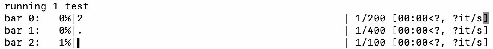

# tqdm   

>
> Instantly make your loops show a smart progress meter - just wrap any iterable with tqdm(iterable), and you're done!
>

Rust implementation of the popular Python command line progress bar tool [tqdm](https://github.com/tqdm/tqdm/). The name "tqdm" derives from the Arabic word taqaddum (تقدّم) which can mean "progress", and is an abbreviation for "I love you so much" in Spanish (te quiero demasiado).




## Quick Start

Simply wrap `tqdm::tqdm()` around any [iterable](https://doc.rust-lang.org/core/iter/trait.Iterator.html):
```rust
use tqdm::tqdm;
for i in tqdm(0..10000) {
    /* Your loop logic here */
}
```

This function returns a wrapper iterator that controls multiple progress bars, advancing the meter when `next` is called. Methods on the original iterable are bypassed using the [auto-dereference](https://doc.rust-lang.org/std/ops/trait.Deref.html) trait, so they can be called with no overhead.

```
 76%|███████████████▉     | 7618/10000 [00:09<00:03, 782.14it/s]
```

## Usage

Styles and other parameters can be configured in-place:

```rust
use tqdm::Style;
for i in tqdm(0..100)
    .style(Style::Balloon)
    .desc(Some("some description")) {
    /* Your loop logic here */
}
```

```
 47%|**********.          | 4792/10000 [00:06<00:06, 783.39it/s]
```

Expose the `tqdm::Iter` trait to allow method chaining:

```rust
use tqdm::Iter;
for i in (0..).take(10000).tqdm() {
    /* Your loop logic here */
}
```

Alternatively, create a progress bar with `tqdm::pbar()` and manually update it:

```rust
use tqdm::pbar;
let mut pbar = pbar(Some(44850));

for i in 0..300 {
    pbar.update(i).unwrap();
    /* Your loop logic here */
}
```

### Advanced Usage

Multi-bars are also supported! Tqdm maintains a global registry to handle multiple bars:

```rust
use tqdm::tqdm;
for t in (0..3) {
    std::thread::spawn(move || {
        for i in tqdm(0..).desc(Some(i)) {
            /* Your loop logic here */
        }
    })
}
```

```
 38%|##########0               | 77/200 [00:00<00:01, 83.24it/s]
 77%|████████████████████      | 77/100 [00:00<00:00, 83.24it/s]
 19%|*****.                    | 77/400 [00:00<00:03, 83.24it/s]
```

Async iterator items can be tracked using `tqdm::tqdm_async()` (you may need an async runtime like [tokio](https://tokio.rs)):

```rust
use tqdm::tqdm_async;

#[tokio::main]
async fn main() {
    use tokio::time::{sleep, Duration};
    let future_iter = (0..100).map(|i| sleep(Duration::from_secs_f64(i as f64 / 100.0)));
    futures::future::join_all(tqdm_async(future_iter)).await;
}
```

For more usage, please refer to [doc](https://docs.rs/tqdm/latest/tqdm).


## License


